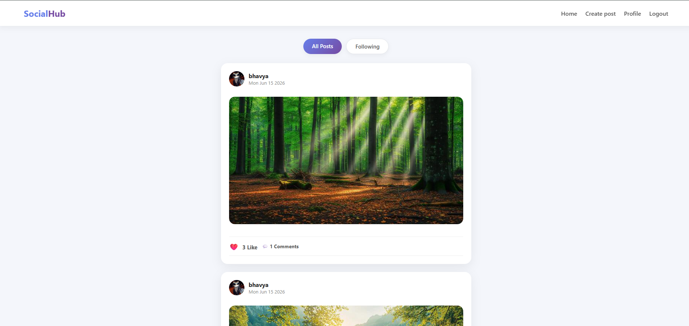
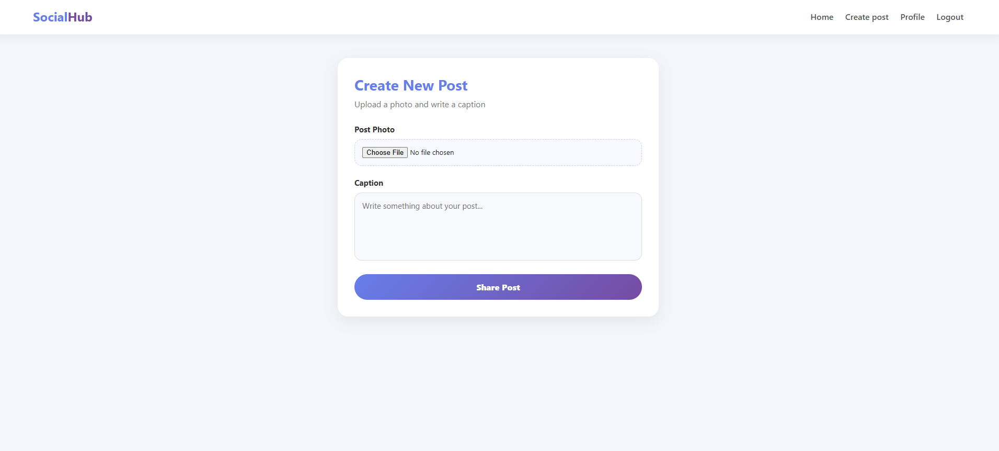
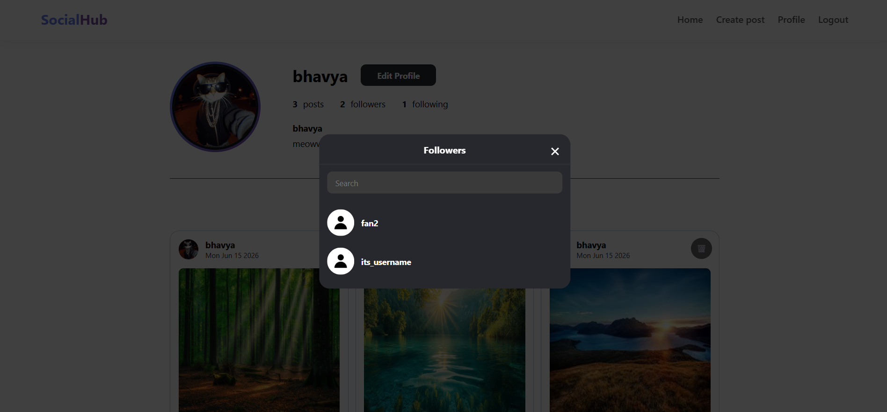

# 🌐 SocialHub - Mini Social Media Platform

A modern social media web application inspired by Instagram, built using **Node.js**, **Express.js**, **MongoDB**, **Mongoose**, **EJS**, **HTML**, **CSS**, and **JavaScript**.

Users can create accounts, upload posts, follow other users, like posts, comment on posts, and manage their profiles in a clean and interactive social networking environment.

---

## 🚀 Features

### 👤 User Authentication

* 🔐 User Registration
* 🔑 User Login
* 🚪 User Logout
* 🗄️ Session Management using Express Session
* 🔒 Password Hashing using Bcrypt

---

### 📝 Posts

* 📸 Upload Images
* ✍️ Add Captions
* 🗑️ Delete Own Posts
* 📅 Posts Sorted by Latest First
* 🖼️ Personal Post Gallery

---

### ❤️ Like System

* ❤️ Like/Unlike Posts
* ⚡ Real-Time Like Updates using Fetch API
* 📊 Dynamic Like Counter

---

### 💬 Comment System

* 💬 Add Comments
* 📜 View All Comments
* ⚡ Comment Popup Modal
* 🔄 Dynamic Comment Count Update

---

### 👥 Follow System

* ➕ Follow Users
* ➖ Unfollow Users
* 👤 Followers Count
* 👤 Following Count
* 📋 Followers/Following Popup List
* ⚡ Real-Time Follow Updates

---

### 📱 Feed System

* 🌎 View Posts From All Users
* 👥 View Posts From Following Users Only
* 📅 Newest Posts Displayed First
* ❤️ Like and Comment Directly From Feed

---

### 🙍 Profile Management

* 🖼️ Profile Picture Upload
* ✏️ Edit Username
* 📝 Edit Bio
* 📊 View Followers / Following
* 📸 View Uploaded Posts
* 🗑️ Delete Own Posts

---

## 🛠️ Tech Stack

### Frontend

* 🎨 HTML5
* 🎨 CSS3
* ⚡ JavaScript
* 🖥️ EJS Template Engine

### Backend

* 🚀 Node.js
* ⚡ Express.js

### Database

* 🍃 MongoDB
* 🗄️ Mongoose

### Authentication & Security

* 🔐 Bcrypt.js
* 🧾 Express Session

### File Uploads

* 📁 Multer

---

## 📂 Project Structure

```bash
SocialHub/
│
├── controllers/
│   ├── authcontroller.js
│   ├── postcontroller.js
│   └── usercontroller.js
│
├── models/
│   ├── User.js
│   └── Post.js
│
├── routes/
│   ├── authrouter.js
│   ├── postrouter.js
│   └── userrouter.js
│
├── middlewares/
│   └── multer.js
│
├── public/
│   ├── css/
│   ├── js/
│   ├── uploads/
│   └── images/
│
├── views/
│   ├── partials/
│   ├── login.ejs
│   ├── registration.ejs
│   ├── feed.ejs
│   ├── profile.ejs
│   ├── create_post.ejs
│   └── edit_profile.ejs
│
├── app.js
├── package.json
└── .env
```

---

## 🗃️ Database Models

### 👤 User Model

```javascript
User
├── name
├── email
├── password
├── bio
├── profileImage
├── followers[]
└── following[]
```

### 📝 Post Model

```javascript
Post
├── user
├── image
├── caption
├── likes[]
├── comments[]
└── createdAt
```

---

## ⚙️ Installation

### Clone Repository

```bash
git clone https://github.com/Bhavya0706/CodeAlpha_Social-Media-Platform.git
```

### Move Into Project

```bash
cd socialhub
```

### Install Dependencies

```bash
npm install
```

### Create .env File

```env
MONGO_URI=your_mongodb_connection_string
PORT=3000
```

### Start Server

```bash
npm start
```


---

## 🌍 Application Flow

```text
Register
   ↓
Login
   ↓
Feed Page
   ↓
Create Post
   ↓
Like / Comment
   ↓
Follow Users
   ↓
Profile Management
```

---

## 📸 Screens Included

✅ Profile Page
.png)

✅ Feed Page


✅ Create Post Page


✅ Followers / Following Modal



---

## 👨‍💻 Author

### Bhavya Suthar

🎓 B.Tech Information Technology

🏫 L.D. College of Engineering

💻 Full Stack Web Developer

🚀 Passionate About Web Development & Software Engineering


